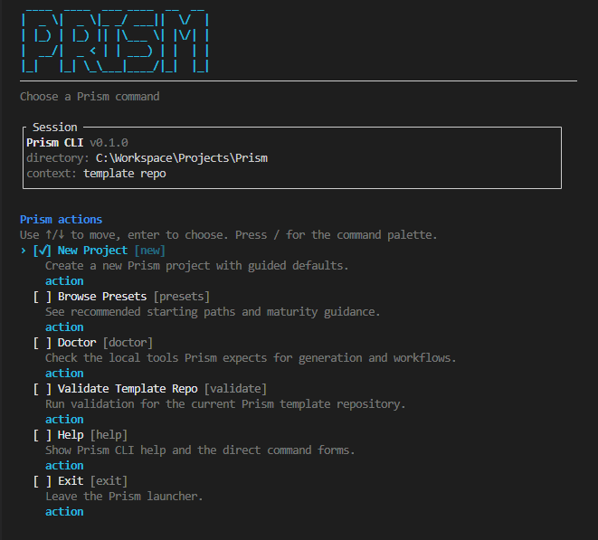
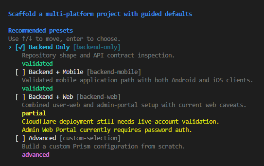

# Prism: One spec. Every platform.


Prism is a multi-platform project generator and workflow model for AI-assisted product
development.

It helps you:

- generate a backend, web, Android, and iOS monorepo from one guided entry point
- give Claude, Codex, and Cursor the same shared product context
- run product work through one living wiki instead of scattered prompts and local memory

This repository is the Prism template and CLI. It is not a generated project.



The Prism launcher is the main entry point for generation, validation, and orientation.

## What Prism Generates

A Prism-generated repository can include:

- **Backend**: Spring Boot 4, Kotlin 2.2+, Java 21
- **User Web App**: Next.js + TypeScript
- **Admin Web Portal**: Next.js + TypeScript
- **Android**: Kotlin + Jetpack Compose
- **iOS**: Swift + SwiftUI

Every generated repository also includes:

- a living product wiki under `knowledge/wiki/`
- generated AI context for Claude, Codex, and Cursor
- lifecycle commands for PO, design, dev, and advisory review
- project docs, generators, and workflow wiring

## Quick Start

If you want to try Prism from this repo:

```bash
pip install copier
pip install -e .
prism
```



From the Prism home screen:

- choose `Doctor` to check prerequisites
- choose `New Project` to generate a sample repo
- choose `Presets` if you want to browse the recommended starting paths first

After generating a project:

1. open the generated repository
2. inspect `README.md`, `CONTEXT.md`, and `knowledge/wiki/SCHEMA.md`
3. initialize the workflow with:
   - Claude Code: `/setup-project`
   - Codex: `$setup-project`
   - Cursor: ask the agent to run `setup-project`

For the full first-run path, read [docs/getting-started.md](docs/getting-started.md).

## Start Here By Goal

### I want to generate a project and evaluate Prism

Read these first:

1. [docs/getting-started.md](docs/getting-started.md)
2. [docs/questionnaire.md](docs/questionnaire.md)
3. [docs/generated-projects.md](docs/generated-projects.md)

### I already have a generated Prism project

Read these first:

1. `README.md` inside the generated repository
2. `CONTEXT.md` inside the generated repository
3. [docs/generated-projects.md](docs/generated-projects.md)
4. [docs/wiki-workflow.md](docs/wiki-workflow.md)

### I want to understand the Prism operating model

Read these in order:

1. [docs/prism-model.md](docs/prism-model.md)
2. [docs/wiki-workflow.md](docs/wiki-workflow.md)
3. [docs/ai-surfaces.md](docs/ai-surfaces.md)

### I want to maintain or improve Prism itself

Start with:

1. [docs/maintainer-workflow.md](docs/maintainer-workflow.md)
2. [docs/current-status.md](docs/current-status.md)
3. [docs/README.md](docs/README.md)

## Current Status

- Backend, Android, and iOS are the stronger paths today.
- User web app and admin web portal generate real slices and pass install/build smoke
  checks, but still need live Cloudflare deployment validation.
- Apple Sign-In remains experimental.
- The safest maintainer workflow remains explicit sample generation plus template
  validation.

For the detailed maturity snapshot, read [docs/current-status.md](docs/current-status.md).

## Learn More

For the full documentation index, read [docs/README.md](docs/README.md).

## Related Repo Files

- [AGENTS.md](AGENTS.md) for Codex maintainer guidance in this repo
- [CLAUDE.md](CLAUDE.md) for Claude maintainer guidance in this repo
